**CS423 – CSC15003 – Software Testing (AI-augmented · 2026\)**

**HW01 – QA/QC Jobs · 20 Defects · Test a Physical Product**

Họ và tên: Trần Đình Luân  
MSSV: 23120059  
Repo Github: https://github.com/naaul1/software-testing-hw1

# Requiremnt 1 - Thị trường việc làm QA/QC 2026+ (10 tin tuyển dụng)

## 1.1 Thông tin tuyển dụng

**Bảng 1. Danh sách 10 tin tuyển dụng**

| # | Vị trí - Công ty | Nguồn  -  Nơi làm | Ngày đăng | Mức lương | AI | Mô tả việc (JD tóm tắt) | Kỹ năng yêu cầu | Link |
|---|------------------|-----------------|-----------|-----------|:---:|---------------------|-----------------|-------------------------------|
| 1 | Senior QA Engineer (Automation, Selenium, Playwright) - Zeya Labs AI | ITviec  -  HCM  -  At office | ~ 16/09 | thương lượng | [Có] | Đảm bảo chất lượng phần mềm enterprise, viết và chạy test automation, tích hợp CI. | Automation Test, Jenkins, API, Cypress, Playwright, Selenium | https://itviec.com/it-jobs/senior-qa-engineer-automation-selenium-playwright-zeya-labs-ai-5714 |
| 2 | Test Automation Engineer - Simpson Strong-Tie Vietnam | ITviec  -  HCM  -  Hybrid | ~ 26/09 | thương lượng | [Có] | Xây dựng test automation cho giải pháp phần mềm, dùng AI hỗ trợ sinh test. | QA QC, Automation Test, Selenium, Appium, AI, Python | https://itviec.com/it-jobs/test-automation-engineer-simpson-strong-tie-vietnam-4435 |
| 3 | [Hanoi] Fullstack QA Engineer Lead (Manual, Auto, AI) - MONEY FORWARD | ITviec  -  HN  -  Hybrid | ~ 15/09 | thương lượng | [Có] | Dẫn dắt team QA fullstack (manual, auto, AI), dẫn dắt chuyển đổi AI trong QA. | Automation Test, Tester, English, Playwright, TypeScript, QA QC | https://itviec.com/it-jobs/hanoi-fullstack-qa-engineer-lead-manual-auto-ai-money-forward-vietnam-co-ltd-4636 |
| 4 | Senior Automation Test (AI, QA QC, API) - Floware | ITviec  -  HCM | ~ 05/09 | thương lượng | [Có] | Viết test automation API, dùng công cụ AI để tăng năng suất test. | Automation Test, CI/CD, API, Tester, AI, Python | https://itviec.com/it-jobs/senior-automation-test-ai-qa-qc-api-floware-1219 |
| 5 | Remote - Automation QA Lead - OrgScale Recruitment | ITviec  -  Remote (HCM) | ~ 19/09 | $2.000-$4.000/tháng | [Có] | Xây dựng chiến lược automation, dẫn dắt team, thiết kế framework test. | AI, Selenium, Cypress, CI/CD, API, DevOps | https://itviec.com/it-jobs/remote-automation-qa-lead-orgscale-recruitment-3015 |
| 6 | Middle QA Automation Engineer (Playwright, Selenium) - FPT Digital | ITviec  -  HN | ~ 16/09 | $800-$1.500/tháng | [Có] | Viết script automation, sinh test case bằng AI, kiểm thử chatbot và RAG. | Automation Test, Cypress, Playwright, Selenium, QA QC, AI | https://itviec.com/it-jobs/middle-qa-automation-engineer-playwright-selenium-fpt-digital-4422 |
| 7 | QA Engineer (Tester, QA QC, English) - Saritasa | ITviec  -  HCM | ~ 17/09 | $1.000-$1.500/tháng | [Không] | Kiểm thử dự án gia công (tích hợp, manual), giao tiếp tiếng Anh, dùng AI tăng tốc. | Integration test, AI, QA QC, English | https://itviec.com/it-jobs/qa-engineer-tester-qa-qc-english-up-to-1500-saritasa-4856 |
| 8 | Middle/Senior Automation QC (Tester, QA QC) - Saigon Technology | ITviec  -  Đà Nẵng  -  Hybrid | ~ 20/09 | thương lượng | [Không] | Viết test automation (Playwright), quản lý test trên Zephyr, chạy CI-CD. | QA QC, Zephyr, API, CI/CD, Playwright, Automation Test | https://itviec.com/it-jobs/middle-senior-automation-qc-tester-qa-qc-saigon-technology-4350 |
| 9 | Quality Engineering Expert (Automation/Performance) - Techcombank | ITviec  -  HN | ~ 19/09 | thương lượng | [Không] | Đảm bảo chất lượng hệ thống ngân hàng, automation và performance test. | Tester, Automation Test, Selenium, Java, QA QC, Oracle | https://itviec.com/it-jobs/quality-engineering-expert-automation-performance-techcombank-3041 |
| 10 | QA Engineer (Manual & Automation Tester) - DXC Vietnam | ITviec  -  HCM | ~ 10/09 | thương lượng | [Không] | Kiểm thử manual và automation cho hệ thống ngân hàng và bảo hiểm. | QA QC, TestComplete, Cypress, Selenium, Automation Test, Tester | https://itviec.com/it-jobs/qa-engineer-manual-automation-tester-dxc-vietnam-1007 |

### Ảnh chụp minh chứng cho 10 tin

**Tin 1 - Senior QA Engineer - Zeya Labs AI**

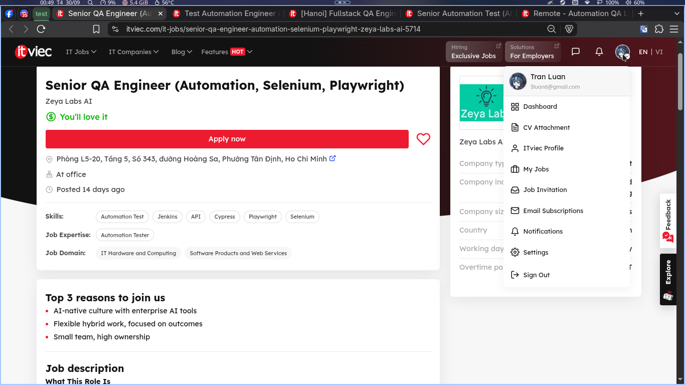

**Tin 2 - Test Automation Engineer - Simpson Strong-Tie Vietnam**

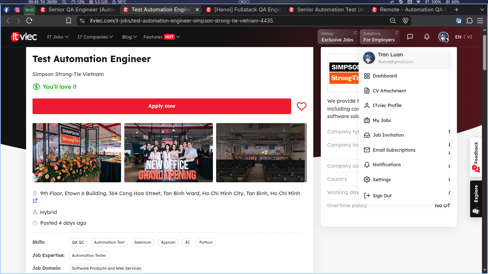

**Tin 3 - Fullstack QA Engineer Lead - MONEY FORWARD**

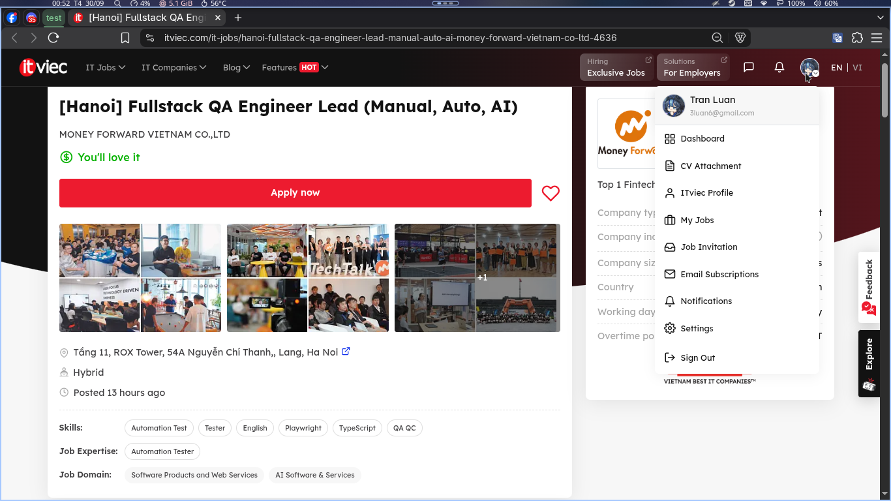

**Tin 4 - Senior Automation Test - Floware**

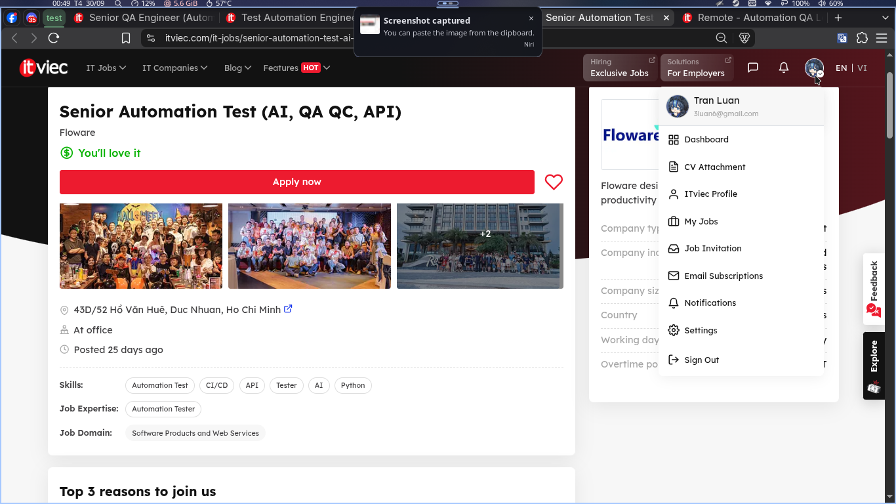

**Tin 5 - Remote Automation QA Lead - OrgScale Recruitment**

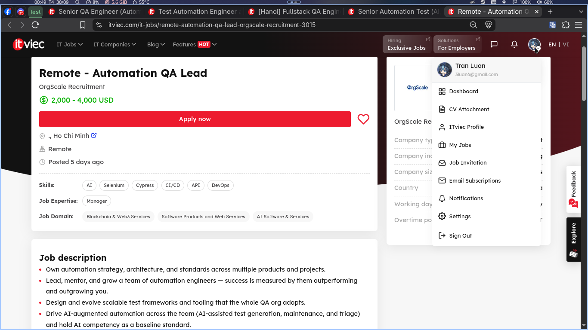

**Tin 6 - Middle QA Automation Engineer - FPT Digital**

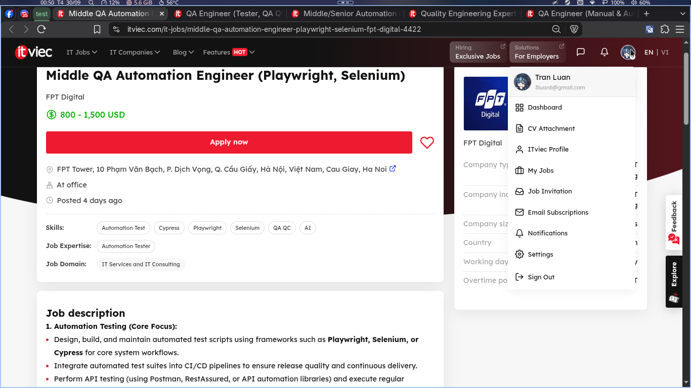

**Tin 7 - QA Engineer - Saritasa**

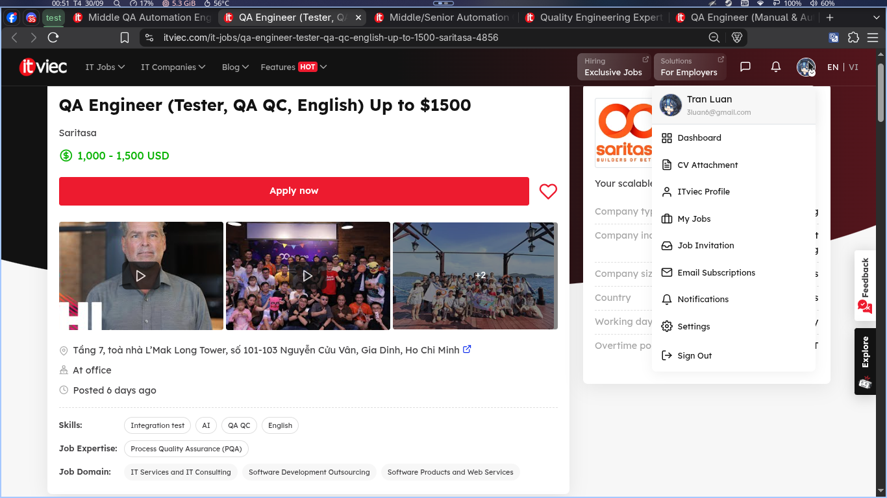

**Tin 8 - Middle/Senior Automation QC - Saigon Technology**

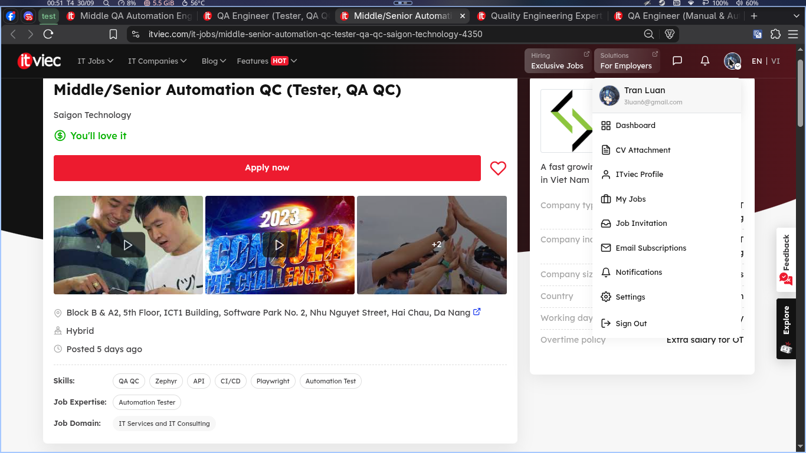

**Tin 9 - Quality Engineering Expert - Techcombank**

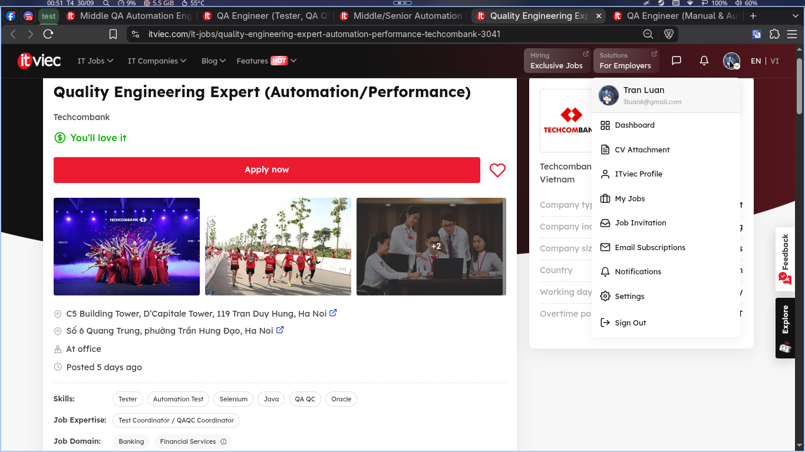

**Tin 10 - QA Engineer - DXC Vietnam**

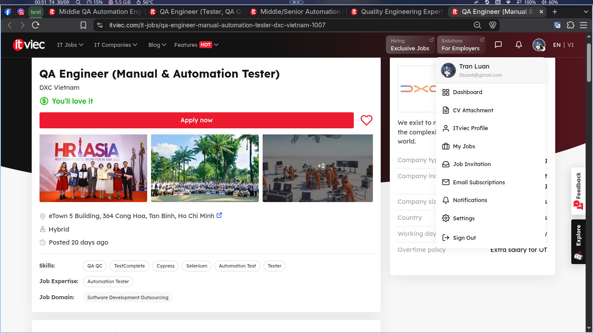

## 1.2 Phân tích tác động AI theo từng tin

**Phân tích tác động AI**:

1. **Zeya Labs AI** - Công ty "AI-native", lấy "enterprise AI tools" làm lý do hàng đầu để gia nhập -> AI là văn hóa làm việc mặc định, QA không biết dùng AI sẽ tụt lại.
2. **Simpson Strong-Tie** - JD yêu cầu rõ "AI-assisted test automation" gồm sinh test bằng AI và prompt engineering -> kỹ năng prompt cho test đã thành yêu cầu tuyển dụng chính thức.
3. **Money Forward** - JD yêu cầu "thành thạo GenAI hằng ngày" và giao dẫn dắt chuyển đổi AI trong QA (test có AI hỗ trợ + test tính năng chatbot/agent) -> AI trở thành năng lực lãnh đạo, không chỉ kỹ thuật.
4. **Floware** - Yêu cầu kinh nghiệm dùng AI (Claude, Cursor, Copilot, ChatGPT) để tăng năng suất test -> AI hỗ trợ thiết kế test và gỡ lỗi đã phổ biến trong QA hàng ngày.
5. **OrgScale** - Ghi rõ "AI competency (required) - baseline, không phải điểm cộng" ngay cả với vai trò remote, lương $2.000-4.000 -> AI là tiêu chuẩn gating cho QA lead.
6. **FPT Digital** - QA vừa dùng AI (sinh test case, viết script) vừa test chính hệ thống AI (chatbot, RAG, độ ổn định prompt) -> hình thành vai trò lai "QA for AI + QA with AI".
7. **Saritasa** - AI xuất hiện như công cụ tăng tốc ("speed up test design and daily work") trong vai trò QA gia công -> AI len lỏi vào cả những vai trò QA truyền thống.
8. **Saigon Technology** - AI hỗ trợ tự động hóa test (Playwright/Zephyr/CI-CD) đang lan tới trung tâm vùng (Đà Nẵng), dù mới chỉ là lợi thế.
9. **Techcombank** - Ngân hàng lớn chính thức coi kiến thức AI và AI-assisted testing là lợi thế khi tuyển kỹ sư quality engineering -> doanh nghiệp có quy định ngặt đang "chính thức hóa" AI vào QA.
10. **DXC** - Vị trí manual + automation cho ngân hàng/bảo hiểm không yêu cầu AI -> thị trường phân cực: nhóm QA AI-driven tăng mạnh nhưng QA truyền thống vẫn tồn tại.

**Nhận định chung (thị trường QA/QC 2026+):**
- **6/10 tin yêu cầu rõ kỹ năng AI/LLM** -> AI thành yêu cầu chính thức khi tuyển QA, không còn chỉ là "điểm cộng".
- AI ảnh hưởng QA theo 2 hướng: **(a) QA với AI** - GenAI tăng tốc thiết kế test case, viết script, gỡ lỗi, triage lỗi; **(b) QA của AI** - test chatbot, RAG, độ ổn định và chất lượng output LLM.
- Nhóm yêu cầu AI tập trung ở phân khúc lương cao: $1.500-$4.000/tháng (OrgScale, FPT Digital) so với nhóm không yêu cầu AI.
- Phân chia theo rubric: AI **thay thế được** (viết script lặp lại, chạy regression, quét log); **hỗ trợ** (thiết kế test, phân tích phủ, triage lỗi); **chưa thay thế được** (đánh giá khám phá, quyết định rủi ro sản phẩm, test thiết bị vật lý).

## 1.3 Sơ đồ mindmap vai trò QA/QC (AI vẽ, sinh viên tìm 3 lỗi)

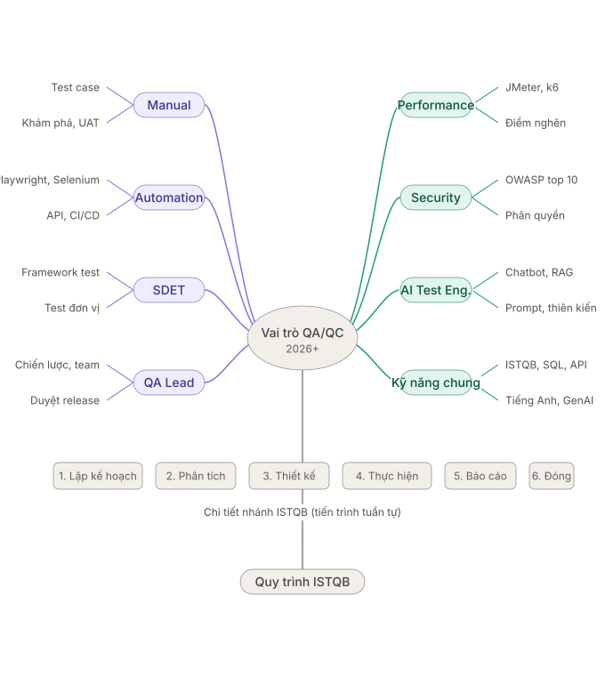

**Những lỗi sai trong mindmap trên:**

1. Các đường nối với node "Performance" và "Kĩ năng chung" bị mất gốc.
2. Quy trình ISTQB có 7 bước, trong khi mindmap chỉ liệt kê 6, gộp implementation và execution lại thành thực hiện, và sắp xếp sai vị trí của "bảo cáo" (bước gốc là monitoring and control).
3. Node "Kỹ năng chung" liệt kê lại ISTQB dù ISTQB đã được nối nhánh lớn từ node "Vai trò QA/QC" rồi.

# Requiremnt 2 - 20 lỗi phần mềm 2022-2026 (bao gồm 6 lỗi AI/LLM)

## 2.1 Các sự cố phần mềm

**Bảng 2. Danh sách 20 sự cố (link truy cập 22/09/2026)**

1. **CrowdStrike Falcon (07/2024) - Mức độ: Critical.** Bản cập nhật Channel File lỗi gây màn hình xanh trên 8,5 triệu máy Windows. Hậu quả: hàng nghìn chuyến bay, ngân hàng, bệnh viện, tổng đài 911 gián đoạn toàn cầu. Giải pháp: phát hành file sửa lỗi, xóa file lỗi bằng Safe Mode/USB từng máy. Nguồn: https://techcrunch.com/2024/07/19/faulty-crowdstrike-update-causes-major-global-it-outage-taking-out-banks-airlines-and-businesses-globally
2. **FAA NOTAM (01/2023) - Mức độ: Critical.** Nhà thầu xóa nhầm file làm hỏng CSDL cảnh báo bay NOTAM. Hậu quả: Mỹ cấm bay toàn quốc lần đầu từ 2001, 11.000+ chuyến trễ/hủy. Giải pháp: khôi phục CSDL, thêm trễ đồng bộ 1 giờ và quy tắc 2 người bảo trì. Nguồn: https://techcrunch.com/2023/01/11/all-u-s-domestic-flights-grounded-as-key-faa-system-goes-down
3. **MOVEit Transfer (05/2023) - Mức độ: Critical.** Nhóm Clop khai thác lỗ SQL injection zero-day cướp dữ liệu của 1000+ tổ chức. Hậu quả: 60 triệu+ người lộ thông tin, gồm cơ quan liên bang Mỹ. Giải pháp: Progress ra bản vá, CISA ra cảnh báo AA23-158a, nạn nhân xoay credential và thông báo. Nguồn: https://techcrunch.com/2023/06/16/us-confirms-federal-agencies-hit-by-moveit-breach-as-hackers-list-more-victims
4. **MGM Resorts ransomware (09/2023) - Mức độ: Critical.** Kẻ tấn công giả mạo help-desk để cài ransomware và tắt toàn bộ IT. Hậu quả: máy slot, ATM, thẻ phòng, đặt chỗ offline nhiều ngày, thiệt hại ~100 triệu USD, mất dữ liệu khách. Giải pháp: từ chối trả tiền chuộc, dựng lại hệ thống với đội ứng cứu, hỗ trợ theo dõi tín dụng. Nguồn: https://techcrunch.com/2023/09/14/mgm-cyberattack-outage-scattered-spider
5. **Change Healthcare ransomware (02/2024) - Mức độ: Critical.** Kẻ tấn công dùng credential bị đánh cắp để cài ransomware lên hệ thống thanh toán. Hậu quả: nhà thuốc/bảo hiểm khắp Mỹ gián đoạn, dữ liệu y tế ~100 triệu người bị cướp. Giải pháp: cô lập hệ thống, trả 22 triệu USD để lấy bản sao dữ liệu, dựng lại với Mandiant. Nguồn: https://techcrunch.com/2024/02/21/change-healthcare-cyberattack
6. **National Public Data (08/2024) - Mức độ: Critical.** Công ty kiểm tra lý lịch để lộ ~2,9 tỉ dòng dữ liệu (SSN, địa chỉ, điện thoại). Hậu quả: nguy cơ đánh cắp danh tính quy mô lớn, dữ liệu bị rao bán. Giải pháp: phối hợp cảnh sát, tắt hệ thống, khuyến nghị đóng băng tín dụng. Nguồn: https://www.theverge.com/2024/8/16/24222112/data-breach-national-public-data-2-9-billion-ssn
7. **AT&T (03/2024) - Mức độ: Critical.** 73 triệu bản ghi khách hàng (SSN, passcode) bị đăng lên dark web. Hậu quả: nguy cơ lừa đảo/giả mạo hàng loạt, phải reset passcode. Giải pháp: reset 7,6 triệu passcode, hỗ trợ theo dõi tín dụng. Nguồn: https://www.theguardian.com/business/2024/mar/31/us-telecoms-firm-att-notifying-millions-of-customers-over-data-breach
8. **XZ Utils backdoor CVE-2024-3094 (03/2024) - Mức độ: Critical.** Kẻ tấn công cài cửa hậu SSH vào xz 5.6.0/5.6.1 qua chuỗi cung ứng. Hậu quả: suýt nữa Linux toàn cầu bị chiếm SSH nếu không phát hiện sớm. Giải pháp: các distro quay về xz 5.4.x, CISA cảnh báo, rà soát. Nguồn: https://www.theguardian.com/commentisfree/2024/apr/06/xz-utils-linux-malware-open-source-software-cyber-attack-andres-freund
9. **Optus (09/2022) - Mức độ: Critical.** API mở để lộ ~10 triệu bản ghi khách hàng Úc. Hậu quả: 2,8 triệu người lộ số hộ chiếu/bằng lái, bị tống tiền 1 triệu USD. Giải pháp: chặn tấn công, báo AFP/ACSC, hỗ trợ giám sát Equifax, thuê Deloitte rà soát. Nguồn: https://www.theguardian.com/business/2022/sep/22/customers-personal-data-stolen-as-optus-suffers-massive-cyber-attack
10. **LastPass (12/2022) - Mức độ: Critical.** Kẻ tấn công dùng khóa dev bị cướp để sao lưu vault mật khẩu mã hóa. Hậu quả: vault khách hàng bị dò brute-force, liên quan vụ trộm crypto 35 triệu+ USD. Giải pháp: xoay secret, dựng lại môi trường dev, yêu cầu đổi mật khẩu chính. Nguồn: https://techcrunch.com/2022/12/22/lastpass-customer-password-vaults-stolen
11. **Uber (09/2022) - Mức độ: High.** Thiếu niên 18 tuổi dùng MFA-fatigue đột nhập, tìm thấy quyền admin trên share nội bộ. Hậu quả: chiếm Slack, console AWS/GCP, báo cáo HackerOne. Giải pháp: cắt truy cập, cứng hóa MFA kiểu number-matching, reset quyền. Nguồn: https://techcrunch.com/2022/09/16/uber-internal-network-hack
12. **Toyota cloud (05/2023) - Mức độ: High.** Cloud T-Connect/G-Link để public từ 2013, lộ vị trí/VIN của 2,15 triệu xe. Hậu quả: lộ dữ liệu định vị kéo dài gần 10 năm. Giải pháp: chặn truy cập ngoài, thêm kiểm toán/giám sát cloud liên tục. Nguồn: https://techcrunch.com/2023/05/12/toyota-japan-exposed-millions-locations-videos
13. **Microsoft Storm-0558 (06/2023) - Mức độ: Critical.** Nhóm tấn công giả mạo token bằng khóa MSA bị cướp để đọc mail Exchange của ~25 tổ chức. Hậu quả: mail Chính phủ Mỹ bị rút trộm cả tháng không phát hiện. Giải pháp: thu hồi khóa, sửa kiểm tra token, thêm phát hiện với CISA/FBI. Nguồn: https://techcrunch.com/2023/07/12/chinese-hackers-us-government-microsoft-email/
14. **PowerSchool (01/2025) - Mức độ: Critical.** Kẻ tấn công dùng credential hỗ trợ bị lộ để cướp dữ liệu SIS học sinh/giáo viên. Hậu quả: hàng chục triệu học sinh lộ SSN, điểm, dữ liệu y tế, bị tống tiền. Giải pháp: cô lập, trả tiền để xóa dữ liệu, điều tra với CrowdStrike, thông báo. Nguồn: https://techcrunch.com/2025/01/08/edtech-giant-powerschool-says-hackers-accessed-personal-data-of-students-and-teachers
15. **[AI] Luật sư dùng ChatGPT bịa án lệ - Mata v. Avianca (06/2023) - Mức độ: High (ảo giác).** Luật sư nộp bản luận viện dẫn 6 án lệ do ChatGPT bịa ra. Hậu quả: tòa phạt 5.000 USD, bác đơn kiện. Giải pháp: bắt buộc kiểm chứng output AI bằng người, cấm dùng AI không kiểm chứng. Nguồn: https://www.theguardian.com/technology/2023/jun/23/two-us-lawyers-fined-submitting-fake-court-citations-chatgpt
16. **[AI] Samsung lộ bí mật qua ChatGPT (04/2023) - Mức độ: Critical (rò rỉ dữ liệu).** Kỹ sư dán code/dữ liệu lợi nhuận/biên bản họp lên ChatGPT để debug. Hậu quả: IP mật truyền ra máy chủ ngoài, nguy cơ lộ vào output sau. Giải pháp: cấm AI trên máy công ty, xây công cụ AI nội bộ có kiểm soát dữ liệu. Nguồn: https://www.cnbc.com/2023/05/02/samsung-bans-use-of-ai-like-chatgpt-for-staff-after-misuse-of-chatbot.html
17. **[AI] Bard báo sai về kính JWST (02/2023) - Mức độ: High (ảo giác).** Video quảng cáo nói sai kính Webb chụp ảnh exoplanet đầu tiên (thực tế là VLT, 2004). Hậu quả: cổ phiếu Alphabet mất ~7-9%, bay ~100 tỉ USD vốn hóa. Giải pháp: mở rộng chương trình Trusted Tester, kiểm thử trong + ngoài trước khi mở rộng. Nguồn: https://fortune.com/2023/02/08/google-bard-ai-mistake-ad-stock-price-market-cap
18. **[AI] Chatbot đại lý Chevrolet bán Tahoe giá 1 USD (12/2023) - Mức độ: Medium (prompt injection).** Người dùng chèn lệnh khiến bot đồng ý mọi thứ và chấp nhận giá 1 USD cho xe Tahoe 2024. Hậu quả: báo chí đưa tin, mất uy tín, tranh cãi về giá trị ràng buộc của bot. Giải pháp: tắt bot, cứng prompt để từ chối lệnh ngoại lệ và ép giá. Nguồn: https://www.businessinsider.com/car-dealership-chevrolet-chatbot-chatgpt-pranks-chevy-2023-12
19. **[AI] Chatbot Air Canada báo sai giá vé (02/2024) - Mức độ: Medium (ảo giác).** Bot nói sai khách được mua vé full rồi hoàn tiền tang chế trong 90 ngày. Hậu quả: tòa buộc hãng trả ~812 CAD, khẳng định công ty chịu trách nhiệm cho lỗi bot. Giải pháp: trả tiền, sửa/gỡ bot gây hiểu lầm. Nguồn: https://www.theguardian.com/world/2024/feb/16/air-canada-chatbot-lawsuit
20. **[AI] Google Gemini vẽ ảnh sai lịch sử (02/2024) - Mức độ: High (thiên kiến).** Tính năng cân bằng đa dạng sinh ra lính Đức và cha lập quốc Mỹ có màu da sai lịch sử. Hậu quả: phản ứng dư luận, Google tạm dừng sinh ảnh người. Giải pháp: tạm dừng tính năng, hiệu chỉnh lại mô hình với ngữ cảnh lịch sử và kiểm thử mở rộng. Nguồn: https://www.theverge.com/2024/2/22/24079876/google-gemini-ai-photos-people-pause

## 2.2 Chỉ ra một lỗi của AI ở mục trên

- Ở sự cố thứ 20 trên, AI mô tả lỗi là do bias. Tuy nhiên, lỗi đó thực chất do cơ chế cân bằng đa dạng bị overcorrect, từ đó mới tạo sinh sai thực tế. Lỗi này nên được gắn nhãn là "hallucination" thì đúng hơn là do "bias".

# Requiremnt 3 - Kiểm thử ấm đun nước Happy Cook HEK-17WF

## 3.1 Thông tin thiết bị

- Nhãn hiệu: Happy Cook; Model: HEK-17WF; Dung tích: 1,7 lít; Năm mua: 04/2018.
- Số serial (che 4 ký tự giữa): không đọc được do tem bị tróc.
- Ảnh: 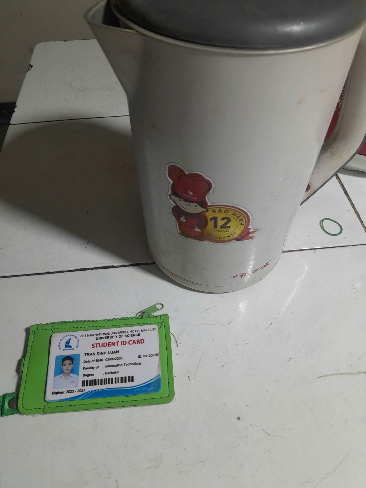

## 3.2 Bảng 15 test cases

| ID | Mục tiêu | Đầu vào | Các bước | Mong đợi | Thực tế | Verdict |
|----|----------|---------|----------|----------|---------|---------|
| TC01 | Đun sôi lượng nước định mức thì tự ngắt | Nước đến vạch MAX, nắp đóng, đặt đúng đế, cắm điện | 1. Đổ nước đến MAX. 2. Đóng nắp. 3. Đặt lên đế. 4. Bật công tắc. | Nước sôi, công tắc tự ngắt, đèn tắt. | Như mong đợi | Pass |
| TC02 | Tắt thủ công giữa chừng | Ấm đang đun | 1. Bật đun. 2. Gạt công tắc về OFF khi chưa sôi. | Dừng đun ngay, đèn tắt. | Như mong đợi | Pass |
| TC03 | Bảo vệ khi đun không có nước | Ấm rỗng, nắp đóng | 1. Để ấm rỗng. 2. Bật công tắc. 3. Quan sát. | Tự ngắt chống cháy, không chảy nhựa, không khét. | Không thực hiện vì nguy hiểm | Blocked |
| TC04 | Châm quá vạch MAX | Nước trên vạch MAX, nắp đóng | 1. Đổ quá MAX. 2. Đun đến sôi. 3. Quan sát vòi và nắp. | Ghi nhận nước có trào qua vòi/nắp hay không; trào vào đế điện là không đạt an toàn. | Nước không trào | Pass |
| TC05 [edge] | Đun khi nắp mở | Nước định mức, nắp mở | 1. Đổ nước. 2. Mở nắp. 3. Bật đun và quan sát. | Ghi nhận hơi thoát, kiểm tra xem có tự ngắt hay không. | Không tự ngắt, vẫn đun tới khi sôi như bình thường | Pass |
| TC06 [edge] | Đun lại ngay sau khi vừa sôi | Ấm vừa tự ngắt, nước còn nóng | 1. Chờ ấm tự ngắt. 2. Bật lại công tắc ngay. | Công tắc và đèn tắt lại rất nhanh. | Như mong đợi | Pass |
| TC07 | Đun với lượng nước ít (0,5 lít) | 0,5 lít nước đong bằng cốc, nắp đóng | 1. Đong 0,5 lít. 2. Đổ vào ấm. 3. Đun đến sôi. | Sôi và tự ngắt bình thường, không cạn nước. | Như mong đợi | Pass |
| TC08 | Đặt ấm lệch khỏi tâm đế | Ấm đặt lệch tâm đế 360, có nước | 1. Đặt ấm lệch. 2. Bật công tắc. | Không vào điện và đèn không sáng. | Như mong đợi | Pass |
| TC09 | Rót nước sau khi sôi | Ấm vừa sôi | 1. Nhấc ấm khỏi đế. 2. Rót ra cốc. | Vòi chảy đều, thân không rò, tay cầm cầm được để rót. | Như mong đợi | Pass |
| TC10 | Tay cầm và vỏ khi sôi | Ấm vừa sôi | 1. Quan sát và chạm vào tay cầm. 2. Chạm nhanh vỏ. | Tay cầm cầm được bình thường, vỏ nóng nhưng không gây bỏng khi chạm nhanh. | Như mong đợi | Pass |
| TC11 | Dây điện và phích cắm | Quan sát + sau 1 lần đun | 1. Kiểm tra dây và phích. 2. Sờ dây/phích sau khi đun. | Dây nguyên vẹn, phích và dây không nóng bất thường. | Như mong đợi | Pass |
| TC12 | Đèn báo trạng thái | Các trạng thái đun/ngắt/nhấc | 1. Quan sát đèn khi bật. 2. Khi sôi ngắt. 3. Khi nhấc khỏi đế. | Đèn sáng khi đun, tắt khi ngắt và khi nhấc ra. | Như mong đợi | Pass |
| TC13 [edge] | Nhấc ấm khỏi đế giữa chừng | Ấm đang đun | 1. Bật đun. 2. Nhấc ấm khỏi đế khi chưa sôi. | Dừng đun ngay, đèn tắt. | Như mong đợi | Pass |
| TC14 | Dung tích thực tế tại vạch MAX duy nhất | Thể tích nước 1,7 lít (bằng dung tích danh định trên tem) | 1. Đong đúng 1,7 lít. 2. Đổ vào ấm. 3. Đối chiếu mực nước với vạch MAX. | Mực nước ngang đúng vạch MAX, sai lệch không đáng kể. | Như mong đợi | Pass |
| TC15 | Độ bền khớp nắp và lòng ấm | Thao tác tay, quan sát mắt thường | 1. Mở/đóng nắp 10 lần. 2. Mở nắp hết cỡ xem có giữ được không, đóng có khớp chắc không. 3. Kiểm tra bản lề và mép nắp. 4. Kiểm tra lòng ấm (rỉ, sứt, cặn, đổi màu). | Nắp đóng mở trơn, khớp chắc, không lỏng và không bung; lòng ấm không rỉ và không sứt. | Như mong đợi | Pass |

## 3.3 Edge cases AI bỏ sót

- 3 case [edge] (TC05, TC06, TC13) là các test case AI bỏ sót khi sinh test case cho ấm đun nước.

## 3.4 Video thực hiện

- [TC02](https://youtube.com/shorts/CmKP73IhZX4?feature=share)
- [TC06](https://youtube.com/shorts/NxDwyZVm_P4?feature=share)
- [TC09](https://youtube.com/shorts/qFO8I_EZIuE?feature=share)
- [TC10](https://youtube.com/shorts/j3VEL9GCoTg?feature=share)
- [TC13](https://youtube.com/shorts/g-O_-NMoCgU?feature=share)

# AI Audit Report

Tóm tắt 7 artifact AI sinh đã audit (bản đủ 5 mục trong [AI-02] đính kèm):

| # | Artifact | Verdict |
|---|----------|---------|
| 1 | 10 dòng phân tích AI impact (Req 1) | INCOMPLETE (2 tin quá hạn, đã thay) |
| 2 | Danh sách 20 lỗi 2022-2026 (Req 2) | INCOMPLETE (sửa nhãn lỗi #20 Gemini) |
| 3 | Khung 15 test case ấm đun (Req 3) | INCOMPLETE (thiếu edge vật lý, sai giả định) |
| 4 | Sửa TC14/TC15 theo cấu tạo thật | VALID |
| 5 | Thay 2 tin quá hạn (Req 1) | VALID |
| 6 | Mindmap QA/QC + ISTQB (G9.1) | INCOMPLETE (sai 7 bước ISTQB, mất gốc nối) |
| 7 | AI điền Actual/Verdict 15 TC | INCOMPLETE (sinh viên kiểm chứng bằng chạy thật + video) |

Tổng: 7 artifact; VALID 2 (29%); INCOMPLETE 5 (71%); INVALID 0. Nội dung đầy đủ và prompt nguyên văn xem ở Phụ lục A [(AI-02)](<AI-compliance/[AI-02] - FIT@HCMUS - AI Audit Report_Vn.md>).

# AI Critique

AI làm tốt ở khâu thu thập và tổng hợp: rà nhiều nguồn trong thời gian ngắn, trích đúng JD và kỹ năng yêu cầu, sinh khung 20 mục lỗi và 15 test case đầy đủ cấu trúc, lấy được 3 mức lương công khai qua JSON-LD mà trang ẩn với người chưa đăng nhập. Tuy nhiên AI sai ở mọi chi tiết cần kiểm chứng thực tế. Thứ nhất, AI gắn nhãn sai nguyên nhân lỗi Gemini (#20) là thiên kiến trong khi bản chất là overcorrect cơ chế cân bằng đa dạng; AI khái quát từ mẫu huấn luyện mà không hiểu cơ chế cụ thể của sự cố. Thứ hai, AI bỏ sót edge case vật lý (đun khi mở nắp, đun lại ngay sau khi sôi, nhấc ấm giữa chừng) và giả định sai cấu tạo ấm (nhiều vạch chia, lưới lọc) vì AI không có ngữ cảnh thiết bị thật. Thứ ba, mindmap AI vẽ mất gốc nối và rút quy trình ISTQB từ 7 bước còn 6 bước, cho thấy AI ưu tiên hình thức gọn hơn tính đúng. Thứ tư, AI chỉ đọc ngày đăng tương đối và không qua được màn hình đăng nhập nên 5 mức lương phải xác minh bằng ảnh chụp tay. Nguyên nhân chung: AI dự đoán từ dữ liệu cũ, không duyệt web có trạng thái và không chạm được thiết bị. Bài học: dùng AI để soạn bản đầu và gợi ý cấu trúc, không bao giờ lấy output AI làm bằng chứng; mọi số liệu phải đối chiếu nguồn sống và ISTQB trước khi chốt; ảnh, video và prompt log là việc của riêng sinh viên.

# Mandatory Disclosure

Tôi, **Trần Đình Luân (23120059)**, khai báo: bản đầu của phân tích AI impact, danh sách 20 lỗi, khung 15 test case và mindmap do OpenCode (Muse Spark 1.3 Free) và Claude Web (Sonnet 5.5) sinh; tôi đã rà soát và chỉnh sửa Yêu cầu 1 (thay 2 tin quá hạn), Yêu cầu 2 (sửa nhãn lỗi #20 Gemini), Yêu cầu 3 (sửa TC14/TC15), bổ sung 3 edge case TC05, TC06, TC13; ảnh chụp tin có tên tài khoản, ảnh thiết bị kèm thẻ sinh viên, 5 video chạy test có giọng thuyết minh và xác nhận lương sau đăng nhập do tôi tự làm. Chi tiết xem AI Audit Report trong [AI-02] và Phụ lục A. Tôi cam đoan không dùng AI để sinh bất kỳ artifact nào thuộc danh mục bị cấm.

# Self-assessment

- **Yêu cầu 1 (40/40):** 10/10 tin trong khoảng thời gian 60 ngày, link còn hoạt động; 6/10 yêu cầu AI/LLM (>= 3); mỗi tin có link, ảnh chụp, mô tả, kỹ năng, lương và phân tích.
- **Yêu cầu 2 (17/20):** đủ 20 lỗi giai đoạn 2022-2026, 6 lỗi AI/LLM (>= 5), mỗi lỗi có nguồn, độ nghiêm trọng, hậu quả, giải pháp; đã chỉ ra 1 lỗi gắn nhãn của AI ở mục 1.2.
- **Yêu cầu 3 (22/25):** đủ 15 TC đúng cấu tạo ấm, 3 edge AI sót (TC05, TC06, TC13), 5 video <= 60s có thuyết minh. Serial không đọc được do tem tróc.
- **AI-1 (8/8):** [AI-02] đủ 7 artifact theo mẫu 5 mục, có tổng kết tỉ lệ.
- **AI-2 (4/4):** AI Critique đủ 200-300 chữ + [AI-03] đã khai.
- **AI-3 (3/3):** [AI-05] đã ký.
- **Tổng tự chấm: 95/100.**

# Appendix A

- **Prompt log:** [prompt-log.md](AI-compliance/prompt-log.md) (mọi prompt kèm timestamp và output nguyên văn).
- **Biểu mẫu AI đã ký:** [AI-02](<AI-compliance/[AI-02] - FIT@HCMUS - AI Audit Report_Vn.md>), [AI-03](<AI-compliance/[AI-03] - FIT@HCMUS - AI Disclosure Form_Vn.md>), [AI-05](<AI-compliance/[AI-05] - FIT@HCMUS - AI Privacy Checklist_Vn.md>), [AI-06](<AI-compliance/[AI-06] - FIT@HCMUS - AI Student Acknowledgement_Vn.docx.md>).
